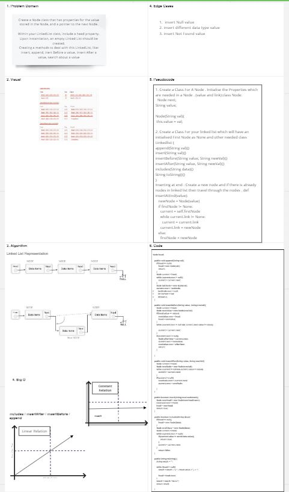
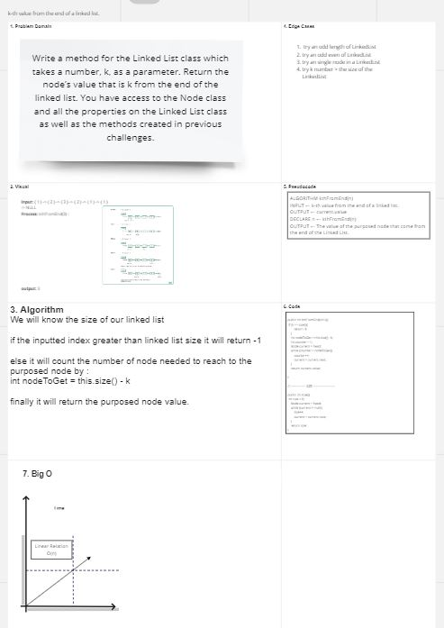
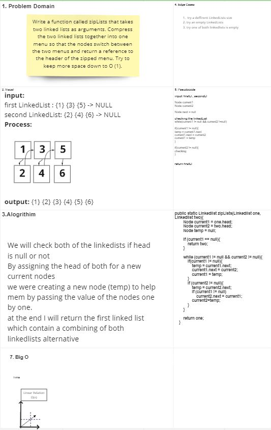
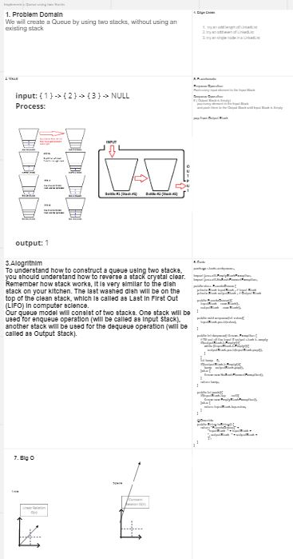

# Singly Linked List
Linked List Implementation

## Challenge
Create a Node class that has properties for the value stored in the Node, and a pointer to the next Node.

Within your LinkedList class, include a head property. Upon instantiation, an empty Linked List should be created.

Define a method called insert which takes any value as an argument and adds a new node with that value to the head of the list with an O(1) Time performance.

Define a method called includes which takes any value as an argument and returns a boolean result depending on whether that value exists as a Node’s value somewhere within the list.

Define a method called toString (or __str__ in Python) which takes in no arguments and returns a string representing all the values in the Linked List, formatted as:
"{ a } -> { b } -> { c } -> NULL"

## Approach & Efficiency
built with object-oriented programming by creating 2-classes one for the linked list, and the other for the Node
the Big O for the methods is O(1) in the best cases and for the worst cases is O(n)

## API
insert(<Node type>): this method will  take any value as an argument and adds a new node with that value to the head of the list

includes(<String>): this method will take any value as an argument and returns a boolean result depending on whether that value exists as a Node’s value somewhere within the list.

toString(): this method takes in no arguments and returns a string representing all the values in the Linked List

append(): adds a new node with the given value to the end of the list

insertBefore(): add a new node with the given newValue immediately before the first value node

insertAfter(): add a new node with the given newValue immediately after the first value node

## Solution

---------------------------------------------------------------------------
# Code Challenge: Class 07 : k-th value

# Challenge Summary
k-th value from the end of a linked list.
## Challenge Description
Write a method for the Linked List class which takes a number, k, as a parameter. Return the node’s value that is k from the end of the linked list. You have access to the Node class and all the properties on the Linked List class as well as the methods created in previous challenges.

## Approach & Efficiency
We will know the size of our linked list
if the inputted index greater than linked list size it will return -1
else it will count the number of node needed to reach to the purposed node by :
int nodeToGet = this.size() - k
finally it will return the purposed node value.

## Solution

----------------------------------------------------------------------------------------------
# Code Challenge: Class 10
# Stacks and Queues
Implementation: Stacks and Queues Lists

---------------------------------------------------------------------------
# Code Challenge: Class 08 : Zip Challenge

# Challenge Summary
Zip two linked lists.

## Challenge Description
Write a function called zipLists which takes two linked lists as arguments. Zip the two linked lists together into one so that the nodes alternate between the two lists and return a reference to the head of the zipped list. Try and keep additional space down to O(1).

## Approach & Efficiency
We will check both of the linkedists if head is null or not
By assigning the head of both for a new current nodes
we were creating a new node (temp) to help mem by passing the value of the nodes one by one.
at the end I will return the first linked list which contain a combining of both linkedlists alternative

## Solution

## Challenge
###### Stack
Create a Node class that has properties for the value stored in the Node, and a pointer to the next Node.
Within your Stack class, include a Top property. Upon instantiation, an empty Stack should be created.
Define a method called push which takes any value as an argument and adds a new node with that value to the top of the stack with an O(1) Time performance.
Define a method called pop that does not take any argument, removes the node from the top of the stack, and returns the node’s value.
Define a method called peek that does not take an argument and returns the value of the node located on top of the stack, without removing it from the stack.
Define a method called isEmpty that takes no argument, and returns a boolean indicating whether or not the stack is empty.

###### Queue
Create a Queue class that has a front property. It creates an empty Queue when instantiated.
This object should be aware of a default empty value assigned to front when the queue is created.
Define a method called enqueue which takes any value as an argument and adds a new node with that value to the back of the queue with an O(1) Time performance.
Define a method called dequeue that does not take any argument, removes the node from the front of the queue, and returns the node’s value.
Define a method called peek that does not take an argument and returns the value of the node located in the front of the queue, without removing it from the queue.
Define a method called isEmpty that takes no argument, and returns a boolean indicating whether or not the queue is empty.

## Approach & Efficiency
built with object-oriented programming by creating 2-classes one for the linked list, and the other for the Node
the Big O for the methods is O(1) for time.

## API
###### Stack
Push - Nodes or items that are put into the stack are pushed
Pop - Nodes or items that are removed from the stack are popped. When you attempt to pop an empty stack an exception will be raised.
Peek - When you peek you will view the value of the top Node in the stack. When you attempt to peek an empty stack an exception will be raised.
IsEmpty - returns true when stack is empty otherwise returns false.

###### Queue
Enqueue - Nodes or items that are added to the queue.
Dequeue - Nodes or items that are removed from the queue. If called when the queue is empty an exception will be raised.
Peek - When you peek you will view the value of the front Node in the queue. If called when the queue is empty an exception will be raised.
IsEmpty - returns true when queue is empty otherwise returns false.

-------------------------------------------------------------------
# Code Challenge: Class 11
### Challenge Summary
Implement a Queue using two Stacks.

### Challenge Description
Create a brand new PseudoQueue class. Do not use an existing Queue. Instead, this PseudoQueue class will implement our standard queue interface (the two methods listed below), but will internally only utilize 2 Stack objects. Ensure that you create your class with the following methods:

enqueue(value) which inserts value into the PseudoQueue, using a first-in, first-out approach.
dequeue() which extracts a value from the PseudoQueue, using a first-in, first-out approach.

### Approach & Efficiency
To understand how to construct a queue using two stacks, you should understand how to reverse a stack crystal clear. Remember how stack works, it is very similar to the dish stack on your kitchen. The last washed dish will be on the top of the clean stack, which is called as Last In First Out (LIFO) in computer science.
Our queue model will consist of two stacks. One stack will be used for enqueue operation (will be called as Input Stack), another stack will be used for the dequeue operation (will be called as Output Stack).

We will Reverse the input Stack to get an output Stack, which we will use it to dequeue.

### Solution

