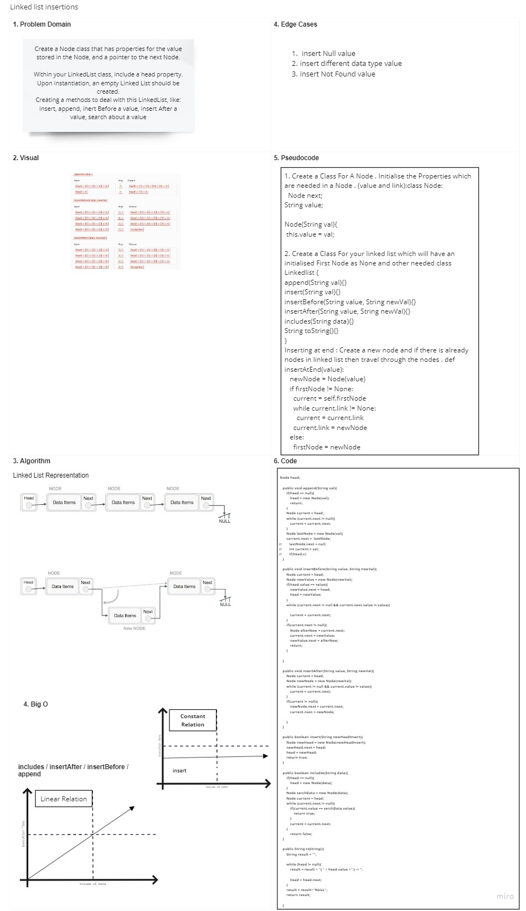

# Singly Linked List
Linked List Implementation

## Challenge
Create a Node class that has properties for the value stored in the Node, and a pointer to the next Node.

Within your LinkedList class, include a head property. Upon instantiation, an empty Linked List should be created.

Define a method called insert which takes any value as an argument and adds a new node with that value to the head of the list with an O(1) Time performance.

Define a method called includes which takes any value as an argument and returns a boolean result depending on whether that value exists as a Node’s value somewhere within the list.

Define a method called toString (or __str__ in Python) which takes in no arguments and returns a string representing all the values in the Linked List, formatted as:
"{ a } -> { b } -> { c } -> NULL"

## Approach & Efficiency
built with object-oriented programming by creating 2-classes one for the linked list, and the other for the Node
the Big O for the methods is O(1) in the best cases and for the worst cases is O(n)

## API
insert(<Node type>): this method will  take any value as an argument and adds a new node with that value to the head of the list

includes(<String>): this method will take any value as an argument and returns a boolean result depending on whether that value exists as a Node’s value somewhere within the list.

toString(): this method takes in no arguments and returns a string representing all the values in the Linked List

append(): adds a new node with the given value to the end of the list

insertBefore(): add a new node with the given newValue immediately before the first value node

insertAfter(): add a new node with the given newValue immediately after the first value node

## Solution

---------------------------------------------------------------------------
# Code Challenge: Class 07 : k-th value

# Challenge Summary
k-th value from the end of a linked list.
## Challenge Description
Write a method for the Linked List class which takes a number, k, as a parameter. Return the node’s value that is k from the end of the linked list. You have access to the Node class and all the properties on the Linked List class as well as the methods created in previous challenges.

## Approach & Efficiency
We will know the size of our linked list
if the inputted index greater than linked list size it will return -1
else it will count the number of node needed to reach to the purposed node by :
int nodeToGet = this.size() - k
finally it will return the purposed node value.

## Solution

---------------------------------------------------------------------------
# Code Challenge: Class 08 : Zip Challenge

# Challenge Summary
Zip two linked lists.

## Challenge Description
Write a function called zipLists which takes two linked lists as arguments. Zip the two linked lists together into one so that the nodes alternate between the two lists and return a reference to the head of the zipped list. Try and keep additional space down to O(1).

## Approach & Efficiency
We will check both of the linkedists if head is null or not
By assigning the head of both for a new current nodes
we were creating a new node (temp) to help mem by passing the value of the nodes one by one.
at the end I will return the first linked list which contain a combining of both linkedlists alternative

## Solution

