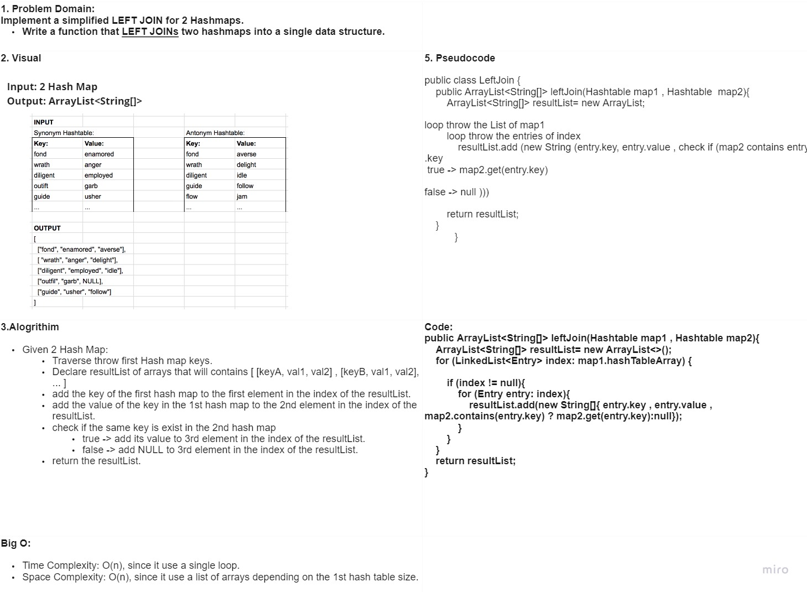

# Hashtable and The Code Challenge Solutions
The following four methods in the [class Hashtable](../hashtable) have a Time Complexity of O(1), and a Space Complexity of O(1):

* add()
    * Takes in both the key and value. This method hashes the key, and adds the key and value pair to the table, handling collisions as needed.
* get()
    * Takes in the key and returns the value from the table.
* contains()
    * Takes in the key and returns a boolean, indicating if the key exists in the table already.
* hash()
    * Takes in an arbitrary key and returns an index in the collection.

-------------------------------------------------------------------------
# Code Challenge: Class 31
### Challenge Summary
Find the first repeated word in a book.

### Challenge Description
Write a function that accepts a lengthy string parameter.
Without utilizing any of the built-in library methods available to your language, return the first word to occur more than once in that provided string.

repeatedWord(String str)

### Approach & Efficiency

Given a string that have words, it requires to find the repeated word  in this inputted string ->
split the given string between the spaces to get a sub array of strings.
if the  sub string contain a comma or a dot ,take it in the consider to avoid messing in the algorithm.
use a hash table to put every sub string in a distinct place in the hash table
call the contain function in my hath table functions to check if I have this key before or not
yes -> return the key
no -> keep tracking

Big O:
Time Complexity: O(n), since it loops throw the array of strings.
Space Complexity: O(1),since it is updating a one variable.

### Solution

-------------------------------------------------------------------------
# Code Challenge: Class 33
### Challenge Summary
Implement a simplified LEFT JOIN for 2 Hashmaps.

### Challenge Description
Write a function that LEFT JOINs two hashmaps into a single data structure.
The first parameter is a hashmap that has word strings as keys, and a synonym of the key as values.
The second parameter is a hashmap that has word strings as keys, and antonyms of the key as values.
Combine the key and corresponding values (if they exist) into a new data structure according to LEFT JOIN logic.

leftJoin(Hashtable map1 , Hashtable  map2)

### Approach & Efficiency

Given 2 Hash Map:
Traverse throw first Hash map keys.
Declare resultList of arrays that will contains [ [keyA, val1, val2] , [keyB, val1, val2], ... ]
add the key of the first hash map to the first element in the index of the resultList.
add the value of the key in the 1st hash map to the 2nd element in the index of the resultList.
check if the same key is exist in the 2nd hash map
true -> add its value to 3rd element in the index of the resultList.
false -> add NULL to 3rd element in the index of the resultList.
return the resultList.

Big O:
Time Complexity: O(n), since it use a single loop.
Space Complexity: O(n), since it use a list of arrays depending on the 1st hash table size.

### Solution

