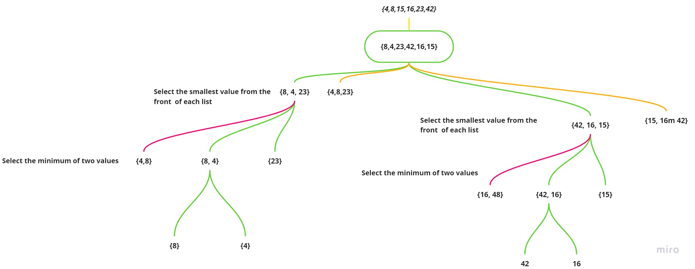

# Sorting Algorithms:

## Insertion Sort
Insertion sort is a simple sorting algorithm that builds the final sorted array one item at a time. It is much less efficient on large lists than more advanced algorithms such as quicksort, heapsort, or merge sort.

The primary advantage of insertion sort over selection sort is that selection sort must always scan all remaining elements to find the absolute smallest element in the unsorted portion of the list, while insertion sort requires only a single comparison when the (k + 1)-st element is greater than the k-th element.

It does not have good time complexity of big o of n. It is O(n^2). This is because in the worst case scenario, you have to swap and compare every single item if the array starts in decreasing order. For smaller sets of data, however, perhaps less than 1000 items, it can be fairly fast.

### Learning Objectives
* Understand what a stored list does, what it is not good at, and how it sorts a list.

### Information Flow

* Array is sorted in place
    * Items are rearranged within the array
* We start from the second item
    * An array with only one item is a sorted list.
* If the item at index i (called a key) is smaller than the value of the item at index j, then the key moves one position to the left.


### Diagram


### Algorithm

1. Work left to right
2. Examine each item and compare that item to items on its left.
3. Insert the item in the correct position in the array, given the item's value.

### Time and complexity
Time complexity: O(n^2) in its worst case where it has to check for each single item value.
Space complexity: O(1) because it does the manipulation on the same array.

### Pseudocode
````
InsertionSort(int[] arr)
  
    FOR i = 1 to arr.length
    
      int j <-- i - 1
      int temp <-- arr[i]
      
      WHILE j >= 0 AND temp < arr[j]
        arr[j + 1] <-- arr[j]
        j <-- j - 1
        
      arr[j + 1] <-- temp
````

### Working Code
[Working Code for insertion sort](/Data-Structures2/app/src/main/java/sort/InsertionSort.java)

### Testing
[Testing for insertion sort](/Data-Structures2/app/src/test/java/sort/InsertionSortTest.java)

----------------------------------------------------------------------------------------
## Merge Sort
Merge sort is one of the most efficient sorting algorithms. 
It works on the principle of Divide and Conquer. 
Merge sort repeatedly breaks down a list into several sublists until each sublist consists of a single element and merging those sublists in a manner that results into a sorted list.

### Learning Objectives
* Understand what a how the merging occurs, what it is not good at, and how it sorts a list.

### Diagram


### Algorithm

Given an array of N items, Merge Sort will:

- Merge each pair of individual element (which is by default, sorted) into sorted arrays of 2 elements,
- Merge each pair of sorted arrays of 2 elements into sorted arrays of 4 elements, Repeat the process...,
- Final step: Merge 2 sorted arrays of N/2 elements (for simplicity of this discussion, we assume that N is even) to obtain a fully sorted array of N elements.

### Time and complexity
Time complexity of Merge Sort is O(n*Log n) in all the 3 cases (worst, average and best) as merge sort always divides the array in two halves and takes linear time to merge two halves.
Space complexity: O(n) ,It requires equal amount of additional space as the unsorted array.


### Pseudocode
````java
ALGORITHM Mergesort(arr)
    DECLARE n <-- arr.length
           
    if n > 1
      DECLARE mid <-- n/2
      DECLARE left <-- arr[0...mid]
      DECLARE right <-- arr[mid...n]
      // sort the left side
      Mergesort(left)
      // sort the right side
      Mergesort(right)
      // merge the sorted left and right sides together
      Merge(left, right, arr)

ALGORITHM Merge(left, right, arr)
    DECLARE i <-- 0
    DECLARE j <-- 0
    DECLARE k <-- 0

    while i < left.length && j < right.length
        if left[i] <= right[j]
            arr[k] <-- left[i]
            i <-- i + 1
        else
            arr[k] <-- right[j]
            j <-- j + 1
            
        k <-- k + 1

    if i = left.length
       set remaining entries in arr to remaining values in right
    else
       set remaining entries in arr to remaining values in left

````

### Working Code
[Working Code for Merge sort](/Data-Structures2/app/src/main/java/sort/MergeSort.java)

### Testing
[Testing for Merge sort](/Data-Structures2/app/src/test/java/sort/MergeSortTest.java)


----------------------------------------------------------------------------------------
## Quick Sort
QuickSort is a Divide and Conquer algorithm. It picks an element as pivot and partitions the given array around the picked pivot.

### Learning Objectives
* Understand what a how the Quick sort occurs, what it is not good at, and how it sorts a list.

### Diagram


### Algorithm

Given an array of N items, Quick Sort will:

- Consider the last element of the list as pivot 
- We reorder all the elements around the pivot – the ones with smaller value are placed before it, and all the elements greater than the pivot after it. 
- The pivot is in its final position. 
- We apply the above steps recursively to both sub-lists on the left and right of the pivot.


### Time and complexity
Time complexity of Quick Sort is, for:
 Best case: the algorithim willl dived the list into two equal size sub-lists,  So, the first iteration of the full n-sized list needs O(n). Sorting the remaining two sub-lists with n/2 elements takes 2*O(n/2) each. As a result, the QuickSort algorithm has the complexity of O(n log n).

 Worst case: the algorithm will select only one element in each iteration, so O(n) + O(n-1) + … + O(1), which is equal to O(n2).

 Average case: O(n*Log n) as it always divides the array in two halves and takes linear time to sort two halves.
Space complexity: O(n) ,It requires equal amount of additional space as the unsorted array.


### Pseudocode
````java
ALGORITHM QuickSort(arr, left, right)
    if left < right
        // Partition the array by setting the position of the pivot value 
        DEFINE position <-- Partition(arr, left, right)
        // Sort the left
        QuickSort(arr, left, position - 1)
        // Sort the right
        QuickSort(arr, position + 1, right)

ALGORITHM Partition(arr, left, right)
    // set a pivot value as a point of reference
    DEFINE pivot <-- arr[right]
    // create a variable to track the largest index of numbers lower than the defined pivot
    DEFINE low <-- left - 1
    for i <- left to right do
        if arr[i] <= pivot
            low++
            Swap(arr, i, low)

     // place the value of the pivot location in the middle.
     // all numbers smaller than the pivot are on the left, larger on the right. 
     Swap(arr, right, low + 1)
    // return the pivot index point
     return low + 1

ALGORITHM Swap(arr, i, low)
    DEFINE temp;
    temp <-- arr[i]
    arr[i] <-- arr[low]
    arr[low] <-- temp
````

### Working Code
[Working Code for Quick sort](/Data-Structures2/app/src/main/java/sort/QuickSort.java)

### Testing
[Testing for Quick sort](/Data-Structures2/app/src/test/java/sort/QuickSortTest.java)
