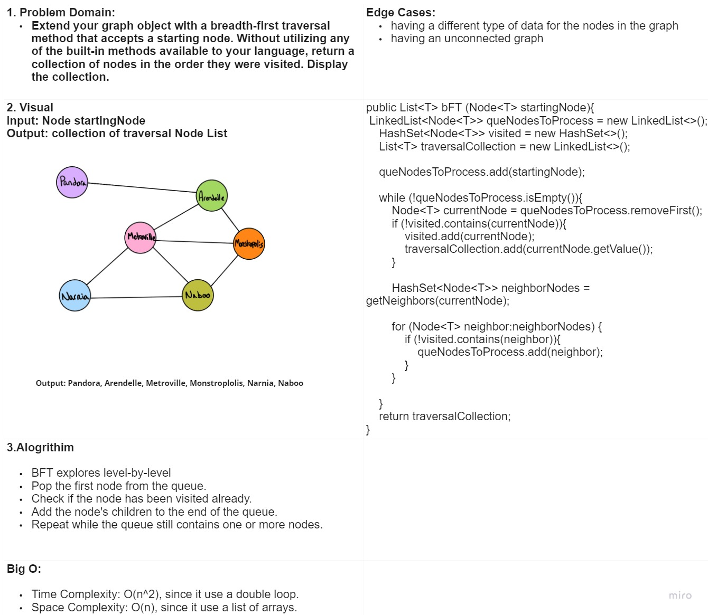
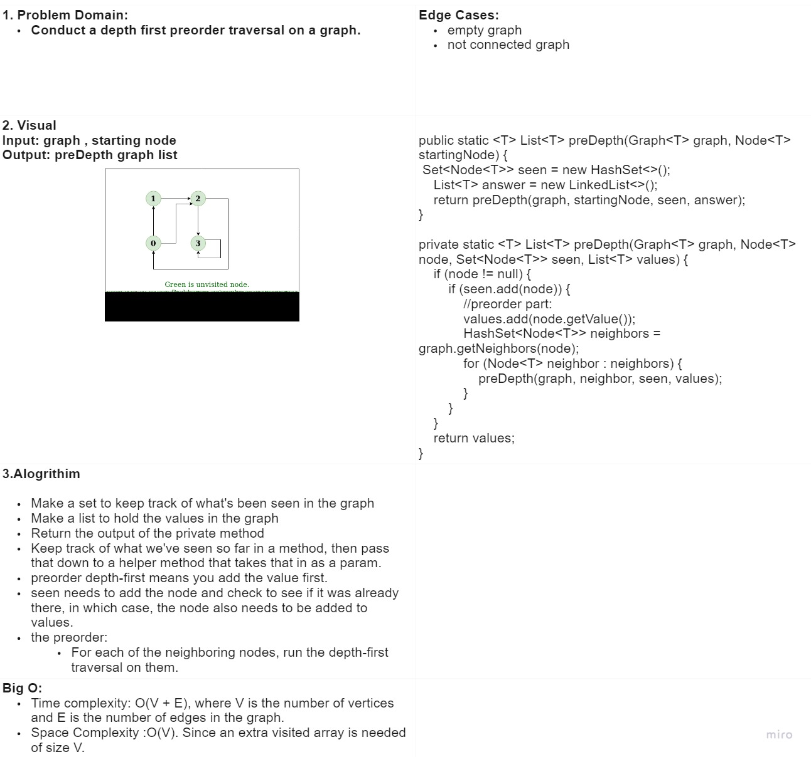

# Graphs
The [Graph](Graph.java) class works with [Edge](Edge.java) class & [Node](Node.java) class.

### The Graph class has the following methods:
* addNode()
* getNodes()
* getNeighbors()
* addEdge()
* getSize()

-------------------------------------------------------------------
# Code Challenge: Class 36
### Challenge Summary
Implement a breadth-first traversal on a graph.

### Challenge Description
Extend your graph object with a breadth-first traversal method that accepts a starting node. Without utilizing any of the built-in methods available to your language, return a collection of nodes in the order they were visited. Display the collection.

bFT (Node<T> startingNode)

### Approach & Efficiency

BFT explores level-by-level
Pop the first node from the queue.
Check if the node has been visited already.
Add the node's children to the end of the queue.
Repeat while the queue still contains one or more nodes.

Big O:
Time Complexity: O(n^2), since it use a double loop.
Space Complexity: O(n), since it use a list of arrays.

### Solution

-------------------------------------------------------------------
# Code Challenge: Class 38
### Challenge Summary
Conduct a depth first preorder traversal on a graph

### Challenge Description
Create a function that accepts an adjacency list as a graph, and conducts a depth first traversal. Without utilizing any of the built-in methods available to your language, return a collection of nodes in their pre-order depth-first traversal order.

preDepth(Graph<T> graph, Node<T> startingNode)

### Approach & Efficiency

Make a set to keep track of what's been seen in the graph
Make a list to hold the values in the graph
Return the output of the private method
Keep track of what we've seen so far in a method, then pass that down to a helper method that takes that in as a param.
preorder depth-first means you add the value first.
seen needs to add the node and check to see if it was already there, in which case, the node also needs to be added to values.
the preorder:
    For each of the neighboring nodes, run the depth-first traversal on them.

Big O:
Time complexity: O(V + E), where V is the number of vertices and E is the number of edges in the graph.
Space Complexity :O(V). Since an extra visited array is needed of size V.

### Solution

