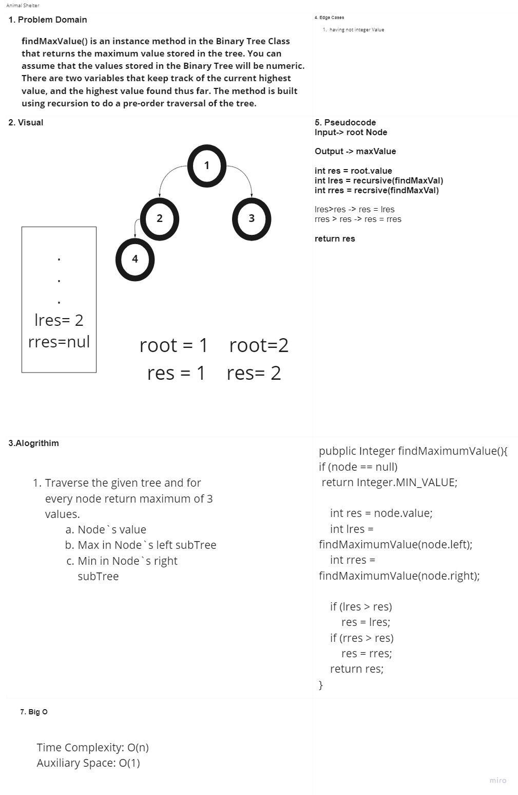
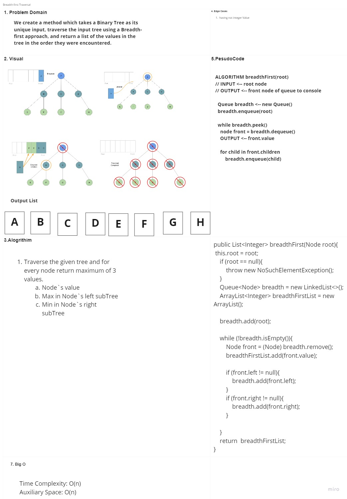

# Code Challenge: Class 15
### Challenge Summary
Implementation: Trees

### Challenge Description
Create a Node class that has properties for the value stored in the node, the left child node, and the right child node.
Create a BinaryTree class
Define a method for each of the depth first traversals called preOrder, inOrder, and postOrder which returns an array of the values, ordered appropriately.

### Approach & Efficiency
A binary tree is a recursive data structure where each node can have 2 children at most.
We were using an auxiliary Node class that will store int values and keep a reference to each child

Inserting Elements
First, we have to find the place where we want to add a new node in order to keep the tree sorted. We'll follow these rules starting from the root node:

* if the new node's value is lower than the current node's, we go to the left child
* if the new node's value is greater than the current node's, we go to the right child
* when the current node is null, we've reached a leaf node and we can insert the new node in that position

Finding an Element
By creating a recursive method that traverses the tree `containsNodeRecursive`\
By searching for the value by comparing it to the value in the current node, then continue in the left or right child depending on that

## API
## Methods
Binary Search Tree Class
`add();`\
accepts a value, and adds a new node with that value in the correct location in the binary search tree.\
Big O time complexity: O(height)

`contains();`\
accepts a value, and returns a boolean indicating whether or not the value is in the tree at least once.\
The Big O space complexity: O(1)

Binary Tree Class
Each method changes the order in which we search/print the root:\
`preOrder();`=> root >> left >> right\
`inOrder();`=> left >> root >> right\
`postOrder();`=> left >> right >> root

---------------------------------------------------------------------------------------
# Code Challenge: Class 16
### Challenge Summary
Find Max Value

### Challenge Description
findMaxValue() is an instance method in the Binary Tree Class that returns the maximum value stored in the tree. You can assume that the values stored in the Binary Tree will be numeric. There are two variables that keep track of the current highest value, and the highest value found thus far. The method is built using recursion to do a pre-order traversal of the tree.

### Approach & Efficiency
`findMaxValue();`\
Big O time complexity: O(n)
The Big O space complexity: O(1)

### Solution

---------------------------------------------------------------------------------------
# Code Challenge: Class 17
### Challenge Summary
Breadth-first Traversal

### Challenge Description
We create a method which takes a Binary Tree as its unique input, traverse the input tree using a Breadth-first approach, and return a list of the values in the tree in the order they were encountered.

### Approach & Efficiency
We check a list of children instead of a left and right child properties.
1. We will still start at the root Node, and we will add it to our queue.
2. As long as we have a node in our queue we can dequeue.
3. With every Node we dequeue, we check it’s list of children and enqueue each one.

`breadthFirst();`\
Big O Space complexity: O(n)
The Big O Time complexity: O(n)

### Solution

